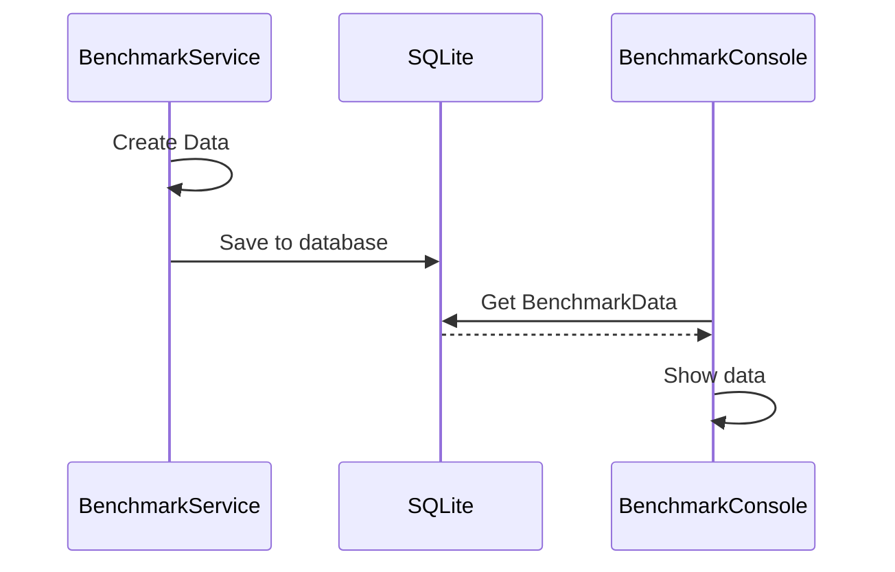

# BenchmarkMonitoring
 C# project for uni

```mermaid
sequenceDiagram
   participant BenchmarkService
   participant SQLite
   participant BenchmarkConsole

   BenchmarkService ->> BenchmarkService: Create Data
   BenchmarkService ->> SQLite: Save to database
   BenchmarkConsole ->> SQLite: Get BenchmarkData
   SQLite -->> BenchmarkConsole: 
   BenchmarkConsole ->> BenchmarkConsole : Show data
```
